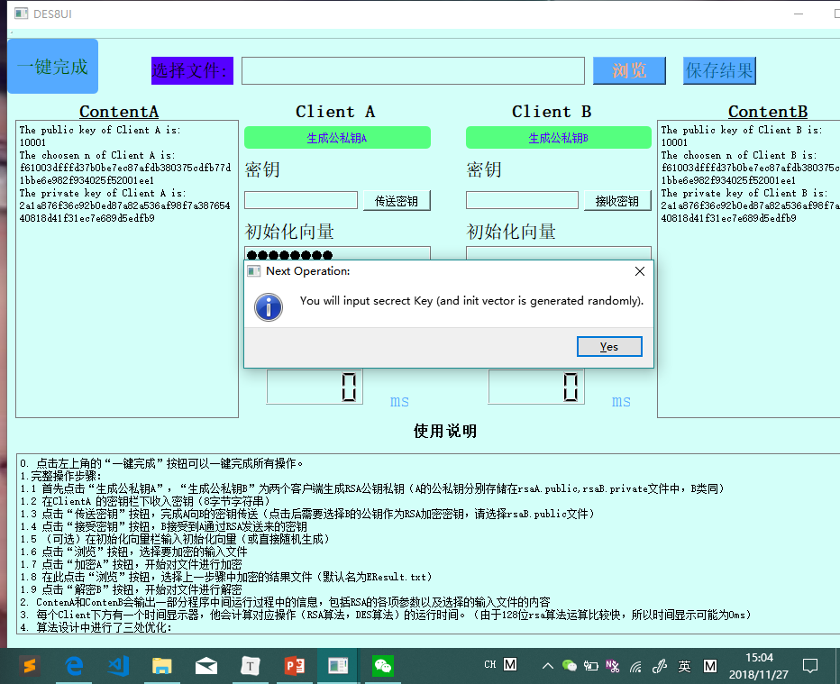
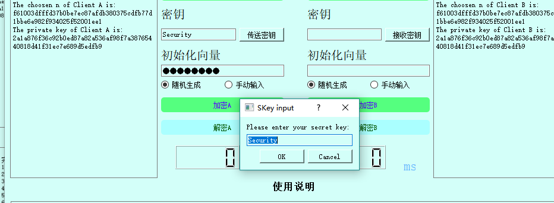
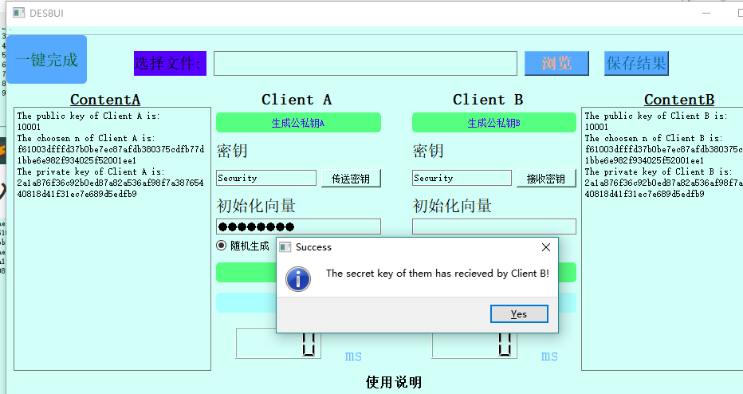
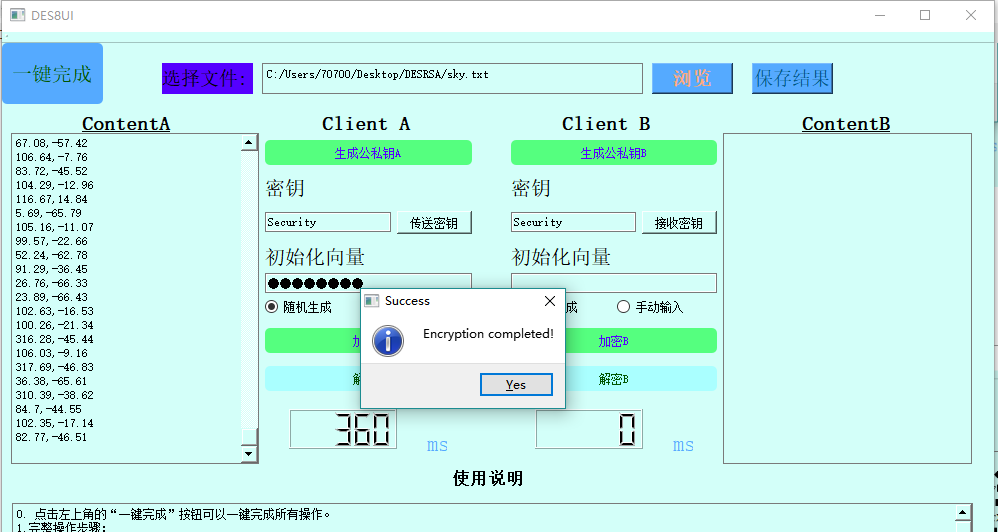
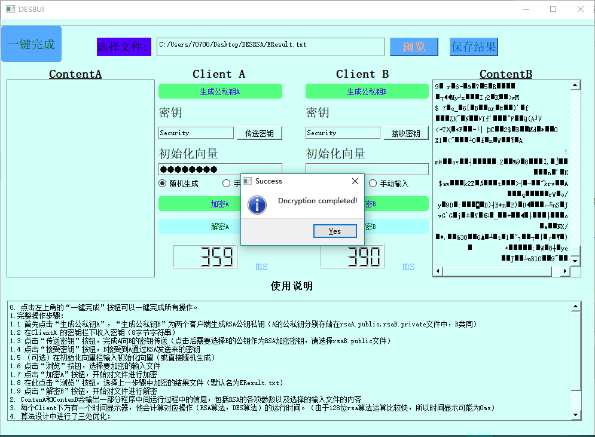

# DES_RSA Encryption Demo Document

常朝坤

16307130138

## 基本信息

- 功能： RSA128 加密Key并传输；DES8 加密解密
- 第三方库： GMP （ C/C++的大整数运算库 ）
- 前端框架： QT5.6
- 注意**：文件路径不得包含中文字符，否则会造成无法正确读写**


## 操作步骤

0. 点击左上角的“一键完成”按钮可以一键完成所有操作（1-9）。
1. 首先点击“生成公私钥A”，“生成公私钥B”为两个客户端生成RSA公钥私钥（A的公私钥分别存储在rsaA.public,rsaB.private文件中，B类同）
2. 在ClientA 的密钥栏下收入密钥（8字节字符串）
3. 点击“传送密钥”按钮，完成A向B的密钥传送（点击后需要选择B的公钥作为RSA加密密钥，请选择rsaB.public文件）
4. 点击“接受密钥”按钮，B接受到A通过RSA发送来的密钥
5. （可选）在初始化向量栏输入初始化向量（或直接随机生成）
6. 点击“浏览”按钮，选择要加密的输入文件
7. 点击“加密A”按钮，开始对文件进行加密
8. 在此点击“浏览”按钮，选择上一步骤中加密的结果文件（默认名为EResult.txt）
9. 点击“解密B”按钮，开始对文件进行解密

## 设计思路

### 后端

- 添加RSA类，包含RSA加密算法的各项参数以及加密、解密、签名和验证功能（签名和验证在本次实验中未作要求，所以并没有嵌入前端）

- 大整数的运算采用了C/C++的第三方库——GMP（https://gmplib.org/）


```c++
win32:CONFIG(release, debug|release): LIBS += -L$$PWD/../../../Program/gmp-6.1.2-2/.libs/ -lgmp
else:win32:CONFIG(debug, debug|release): LIBS += -L$$PWD/../../../Program/gmp-6.1.2-2/.libs/ -lgmpd
else:unix: LIBS += -L$$PWD/../../../Program/gmp-6.1.2-2/.libs/ -lgmp

INCLUDEPATH += $$PWD/../../../Program/gmp-6.1.2-2
DEPENDPATH += $$PWD/../../../Program/gmp-6.1.2-2

win32:CONFIG(release, debug|release): LIBS += -L$$PWD/../../../Program/gmp-6.1.2-2/.libs/ -lgmpxx
else:win32:CONFIG(debug, debug|release): LIBS += -L$$PWD/../../../Program/gmp-6.1.2-2/.libs/ -lgmpxxd
else:unix: LIBS += -L$$PWD/../../../Program/gmp-6.1.2-2/.libs/ -lgmpxx

INCLUDEPATH += $$PWD/../../../Program/gmp-6.1.2-2
DEPENDPATH += $$PWD/../../../Program/gmp-6.1.2-2
```

- 随机数的产生使用了GMP库的默认随机数产生函数mpz_rrandomb（梅森旋转算法），并以当前时间作为种子。
- 素数判定采用了Miller-Rabin检验法，检验设定的轮数是15轮。

### 前端

- 前端的设计上，为了更好地展示RSA加密的过程，设计了两个客户端（ClientA和ClientB）分别作为密钥发送放和密钥接收方。并添加了ContenA和ContenB两个文本框，展示RSA算法的部分中间结果。

- 每个Client在通讯前分别产生自己的RSA，而后由ClientA 确认密钥并通过RSA算法传递给ClientB。
- 两个Client产生的公钥和私钥会分别存储在.public和.private文件中。ClientA在传送密钥时需要选择ClientB的公钥（rsaB.public）进行加密。
- 前端设计时加入了大量的提示框，每完成一项操作都会给予提示（Success/Error），对于一些非法的输入也会通过提示框进行提示，并要求重新输入。

- “一键完成”按钮在内部也加入了大量提示框，以提示用户下一步如何进行操作。

## 算法改进

- 快速模逆算法（对应后端函数fast_powm）。使用快速模逆算法进行所有的大数模运算，并采用e=65537作为公钥加快私钥生成速度。
- 快速解密算法（对应后端函数RSA::fast_rsaDecrypt）。使用中国剩余定理对解密算法进行优化，具体设计可见源码。
- pq限制。随机生成大素数p、q时，为了让算法有更好的安全性，对其长度和差值进行了限制：p、q的大小不大于10^38，p、q差值大于10^11。

## 实验检验

待加密的文件: sky.txt (24000个二维坐标点)

### 产生RSA



### 输入密钥



### RSA传送密钥



### 选择加密文件并加密



### 选择解密文件并解密



### 程序结果

(每次需要保存结果时都要求用户指定目录和文件名，下述位默认文件名)

rsaA.public, rsaA.private: A的公钥和私钥

rsaB.publi, crsaB.private: B的公钥和私钥

EResult.txt: DES加密的结果

DResult.txt: DES解密的结果

(下述为算法过程中产生的中间文件)

encrypt_tmp.txt: DES加密中间文件（=EResult.txt）

decrypt_tmp.txt: DES解密中间文件（=DResult.txt）

input.tmp: 输入文件的副本

## 注意事项

**文件路径请不要含中文字符，否则会导致无法正确读写。**